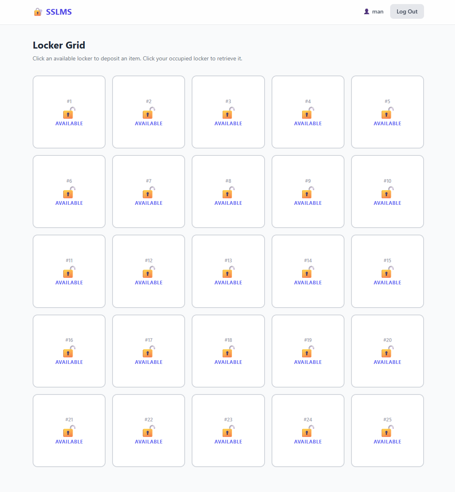
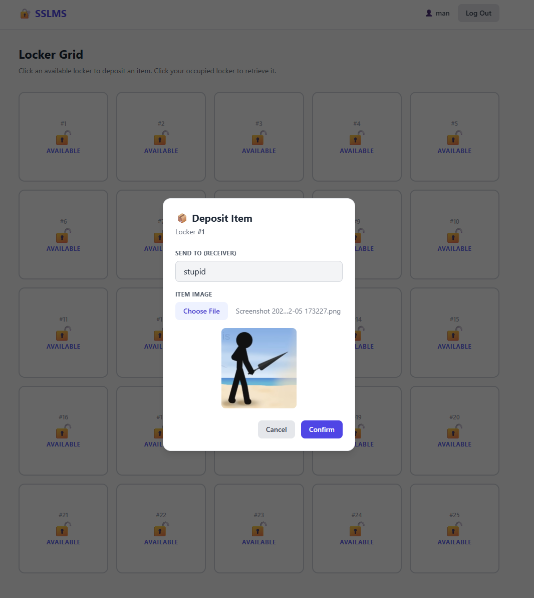
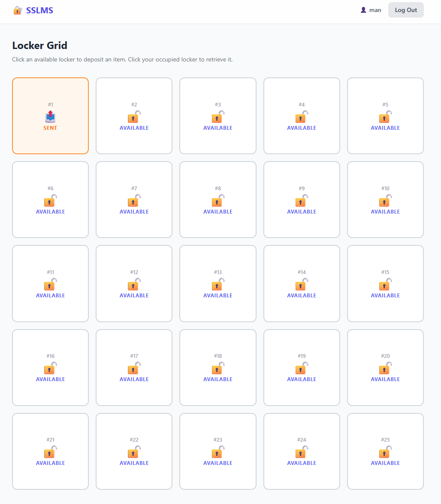
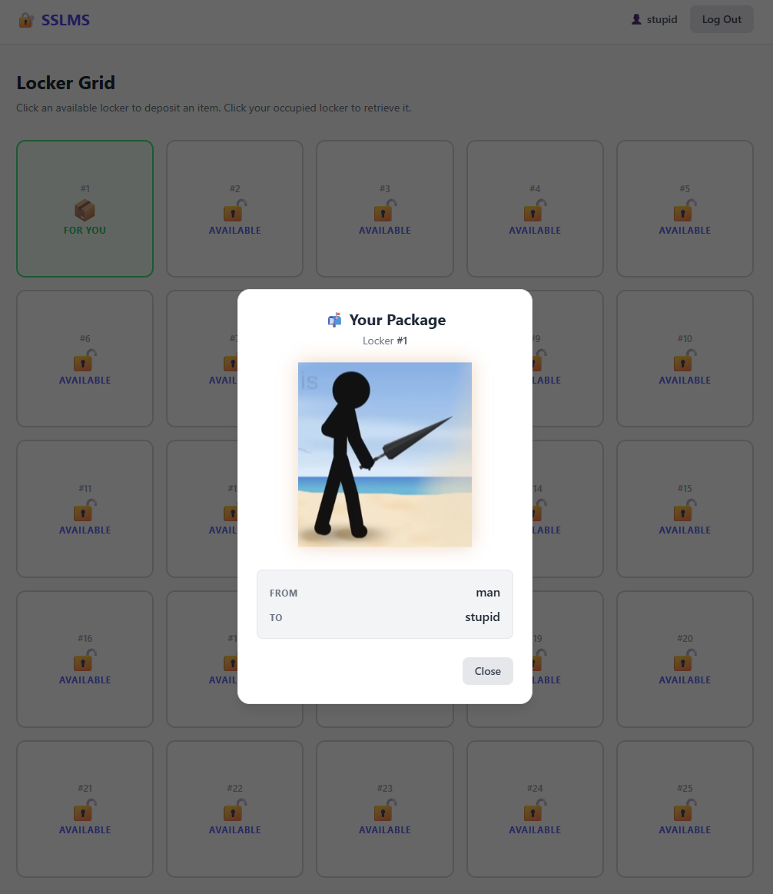
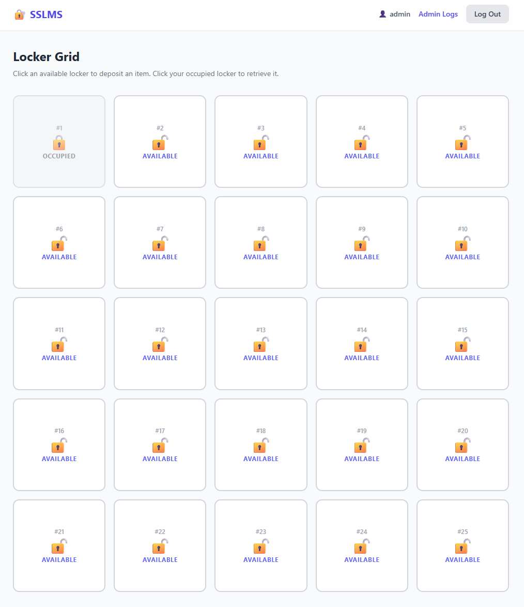
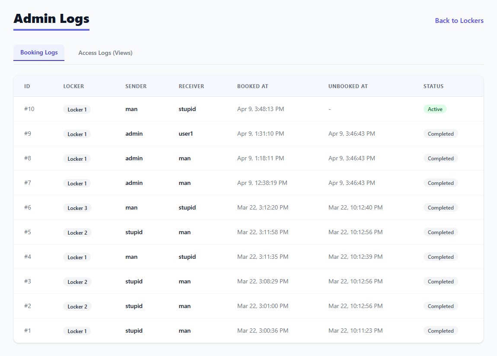
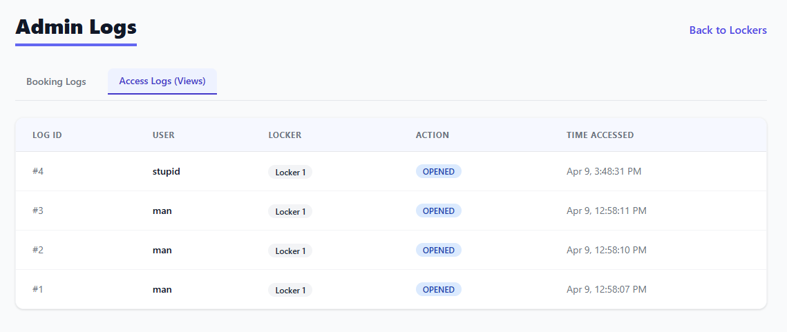

from gettext import installSecure smart locker management system

The secure smart locker management system is a web-based application that simulates how a real smart locker system would work in an apartment or condominium.

The system allows one user to securely deposit an item into a locker for another user to retrieve later. Instead of leaving items with a security guard, the system provides a controlled, traceable, and secure way to exchange items.

Background & Problem

In many apartments, when residents need to give items to someone but cannot meet in person, they leave the item with a security guard. This method:
- Has no tracking system
- Lacks accountability
- May cause privacy concerns
- Provides no secure access control

Objective
- To design and develop a web-based smart locker management system that simulates real-world secure locker functionality.
- To demonstrate secure item exchange with role based access control

Scope
- Software implementation that can be accessed through website
- Hardware implementation is NOT included

Target Users & Roles
1. Giver - deposit item, generate access credentials for the receiver

Permission: Deposit item
2. Receiver - authenticates into the system, retrieves the item

Permission: Retrieve item
3. Admin - view audit logs, doesn’t have permission to open locker

Permission: View logs

Core Features 
1. User authentication
2. Deposit and retrieves item
3. Logs Tab for admin

Tech Stack

Backend: Python, Flask, SQLite

Frontend: Vue.js

# HOW TO RUN

## Docker Way

1. cd to root and run
```python
docker-compose up --build
```
2. Frontend is at http://127.0.0.1:5173/

## Manual Way

1. cd backend
2. activate virtual environment
```
.venv/Scripts/activate
```
3. Install dependencies
```
pip install -r requirements.txt
```

4. Run the app
```
cd ..
python -m backend.app
```

5. cd ..
6. cd frontend
7. Install and run the frontend
```
npm install
npm run dev
```

# Default Users

| username | password      |
|----------|---------------|
| man      | 1234          | 
| user1    | 1234          | 
| user2    | 1234          | 
| stupid   | 1234          |
| admin    | adminpassword |

# Screenshots

1. Logged in



2. Book locker



3. Logged in as sender



4. Logged in as receiver



5. Logged in as admin (There will be admin logs at the top)



6. Admin logs



